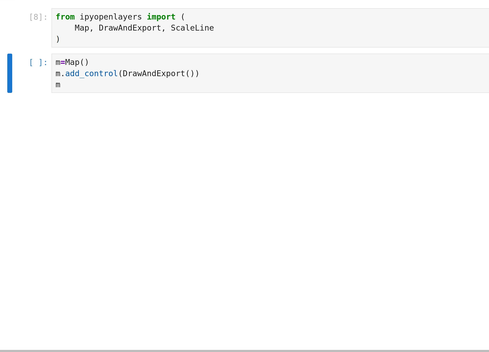

## :wave: Hi, I'm Matt! GitHub: `@mfisher87` {.smaller}

:::::::::columns
::::::{.column width=50%}
:::evenly-spaced
:computer: Research Software Engineer ([RSE](https://us-rse.org/)), Community Manager @ [Schmidt DSE, UC
Berkeley](https://dse.berkeley.edu/)

:people_holding_hands: Community Engagement Manager

:snowflake: Previously at [National Snow & Ice Data Center (NSIDC)](https://nsidc.org)

:open_hands: Open source maintainer & contributor:
[jupytergis](https://github.com/geojupyter/jupytergis),
[jupyter-tiler](https://github.com/geojupyter/jupyter-tiler),
[earthaccess](https://github.com/nsidc/earthaccess),
several [conda-forge](https://conda-forge.org/) packages,
more!

:open_hands: :open_book: :brain:
:seedling: :notes: :drum: :musical_keyboard: :dog:
:::
::::::

::::::{.column width=50%}
](/assets/images/qr.svg){width=100%}
::::::
:::::::::


:::notes
Emojis: Open source, documentation, optimizing for cognitive load, plants and nature,
musical instruments, dogs!
:::


# :earth_asia: GeoJupyter community overview

:link: [geojupyter.org](https://geojupyter.org/)


:::notes
The bulk of my role at Schmidt Center for Data Science and Environment is leading the GeoJupyter project.
:::


## GeoJupyter community overview {.smaller}

:::::::::columns

::::::{.column width="48%"}

:::elevator-pitch
<br />
<br />

<hr />
GeoJupyter is an open and community-owned effort to
[reimagine geospatial interactive computing experiences _within the Jupyter architecture_]{.jupyter-orange}
to enable more people to confidently engage with geospatial data.
<hr />

<br />
<br />

Many players!!!
:::
::::::

::::::{.column width="4%"}
::::::

::::::{.column width="48%"}

::::::

:::::::::


## GeoJupyter community overview {.smaller}

### Geospatial data practice for the modern era

**Geospatial data is everywhere and matters for everyone! 🚚🚢🗺️🧪🌏**

:::evenly-spaced
:handshake: Real-time collaboration (like Google Docs)

:recycle: Reproducibility (by default!)

:leaves: Accessibility (transition to new ways of working, including reproducibility)

:cloud: Cloud-native (computing, data formats)

:robot: AI :scream: :boom: (risks & opportunities)

<br />
<br />
:::

## GeoJupyter community overview {.smaller}

### Open, participatory development

:::evenly-spaced
:revolving_hearts: User-centered & user-led

:hugs: Welcoming (like Jupyter)

:flashlight: Exploring: finding & opening hidden doors

:japanese_castle: Data & computational sovereignty

<br />
<br />
:::


## GeoJupyter community overview {.smaller}

### Partners :scientist: :teacher: :technologist:

* Maryam Hosseini - urban systems, computer vision, & open source
* Clancy Wilmott - Critical Cartography, Geovisualisation and Design
* Char Tomlinson - Earth science, GIS, vertical & volumetric landscapes
* Sarah Chasins & Parker Zeigler - cartography, CS, & open source
* Nancy Thomas & Iryna Dronova - Berkeley Geospatial Innovation Facility
* Carl Boettiger - Geospatial, AI, & education
* Benny Szeghy & Esha Potharaju - GeoJupyter interns
* Qiusheng Wu - Geospatial, AI, & education
* Friends & neighbors: BIDS, MyST, JupyterHub, earthaccess, QuantStack, DevSeed, Pangeo,
  2i2c, Clark University, Stanford, Simula, CNES, ESA
* **MANY MORE!!!**


# :building_construction: Projects in the GeoJupyter community


## JupyterGIS


## :handshake: Collaborate

)](/assets/images/jupytergis-collab-cursors.gif){width=100%}

:::notes
Thanks again to the modular Jupyter architecture, we can leverage
the `jupyter-collaboration` extension, which enables real-time collaboration on
Notebooks, to enable real-time collaboration on a map.

Here you can see two users' cursors (emphasized for visibility) on the same map.
:::


## :handshake: Collaborate: Follow a user

)](/assets/images/jupytergis-collab-follow.gif){width=100%}

:::notes
In this graphic, one user is following another user's viewport activity in real time.
:::


## :handshake: Collaborate: Edit together

)](/assets/images/jupytergis-collab-edit.gif){width=100%}

:::notes
Here you can see collaborators editing a shared map.
:::


## :handshake: Collaborate: Annotations

)](/assets/images/jupytergis-collab-annotate.gif){width=100%}

:::notes
Here you can see collaborators having a spatially aware conversation, like
comments in Google Docs.
:::


## :crystal_ball: Discover data with STAC (WIP)

)](https://eo4society.esa.int/wp-content/uploads/2025/10/screenshot-5.png)

:::notes
We can discover data using Spatio Temporal Asset Catalogs, or "STAC catalogs",
a modern standard for computer interface with data catalogs.

This is a work in progress that will continue to evolve over time!
:::


## Jupyter Tiler


---


## Experiment: reproducible viz -> Notebook workflows




## [Future](https://github.com/geojupyter/initiatives/issues?q=sort%3Aupdated-desc%20is%3Aissue%20is%3Aopen%20label%3A%22type%3A%20initiative%22)

:::evenly-spaced
:open_book: **"Scrollytelling"**
([initiative](https://github.com/geojupyter/initiatives/issues/19))

:robot: GeoAI :thinking:
([initiative](https://github.com/geojupyter/initiatives/issues/14), [prototype](https://github.com/geojupyter/jupyter-geoagent),
[talk](https://www.youtube.com/watch?v=_5yuXU5salY))

:rock: Richer geospatial primitives for Python
([initiative](https://github.com/geojupyter/initiatives/issues/18))

:mountain: Reproducible "geoprocessing" (following lessons learned from interns' exploration) ([initiative](https://github.com/geojupyter/initiatives/issues/3))

:art: Reusable symbology editor component?
([initiative](https://github.com/geojupyter/initiatives/issues/8))

:teacher: Example datasets for education
([initiative](https://github.com/geojupyter/initiatives/issues/9))
:::


# :thought_balloon: Discussions &<br />:boom: Demos

## :boom: :thought_balloon: JupyterGIS

:bug: You might see bugs :face_with_peeking_eye:

:::evenly-spaced
```bash
uv run --with jupyterlab --with jupytergis jupyter lab
```

Or, even cooler...

[:bulb: Launch from our docs (https://jupytergis.readthedocs.io) with JupyterLite](https://jupytergis.readthedocs.io/en/latest/)
- no installation and no signup required.

<br />
:::

:::notes
* Layer gallery (add basemap + chlorophyll)
* Add earthquakes layer
* Inspect data points
* Add france boundaries layer
* Compute convex hulls
* Grammar of graphics
:::


## :thought_balloon: Reproducible viz -> Notebook workflows

Problem: Actions in visualization environments are often not reproducible

{.nostretch width="450px"}


## :boom: :thought_balloon: Roadmapping

:::evenly-spaced
Problem: Hard to track the many things going on and where we're going next

Goal: Roadmapping as a forum, not a static output

[Our "initiatives" GitHub repository](https://github.com/geojupyter/initiatives/)

<br />
:::


## :boom: :thought_balloon: Contributor on-ramps

:::evenly-spaced
Problem: Contributors often ask us where they can get started, it helps to know who to
talk to

Goal: Make it more intuitive for new community members to get started by self-serving
(while building human connection with them)

[Inspiration](https://antennapod.org/contribute/),
[Initiative](https://github.com/geojupyter/initiatives/issues/12),
[GitHub issue](https://github.com/geojupyter/geojupyter.org/issues/127),
[PR](https://github.com/geojupyter/geojupyter.org/pull/134),
[Preview](https://geojupyter--134.org.readthedocs.build/en/134/contribute.html)
:::


## :thought_balloon: What's your pet peeve working with geo data in Jupyter?

::::::evenly-spaced
:::{style="font-size: 5em"}
:ear:
:::
::::::
